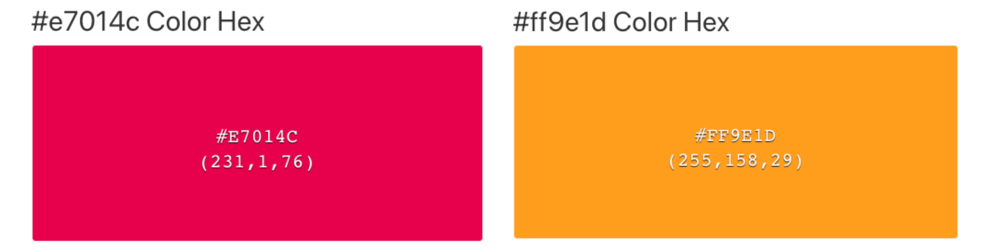
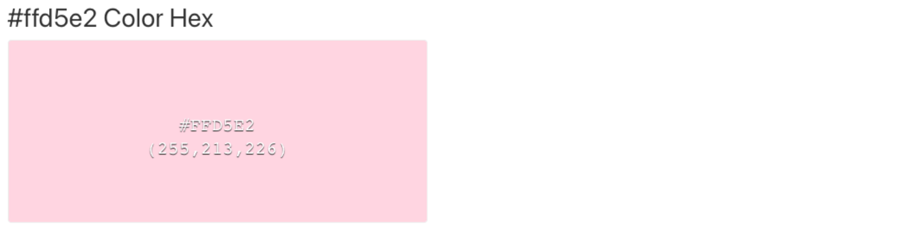

# [ColourChange Challenge](https://sarahgoodwin93.github.io/project2-colourchange-challenge/ "Link to Does It Match Webpage")

The ColourChange Challenge is a game to test your speed and reactions.
Users clicks will be counted, the faster they click, the more they will score!

The site will target people wanting a fun easy game to test their reaction time and eye site. Users can come back to the site to try to beat their score.

In the game the boxes will change colour at various speeds depending on the level, users must click on the correct box for it to be counted as a click and for their score to increase. Aim of the game is try to get the biggest number of clicks.

The timer will get faster, the boxes will change quicker and the fun will get greater!

# Table of Contents

- [ColourChange Challenge](#colourchange-challenge)
- [Table of Contents](#table-of-contents)
- [Key Project Goals](#key-project-goals)
  - [Target Audience](#target-audience)
  - [User Stories](#user-stories)
    - [First time users](#first-time-users)
    - [Returning Users](#returning-users)
    - [Reaction Times](#reaction-times)
- [Design](#design)
  - [Colour Scheme](#colour-scheme)
  - [Wire frames](#wire-frames)
  - [Typography](#typography)
- [Features](#features)
  - [Navigation](#navigation)
  - [Hero Image / Logo](#hero-image--logo)
  - [Home](#home)
  - [How to Play](#how-to-play)
  - [Play Game](#play-game)
  - [The Footer](#the-footer)
- [Features Left to Implement](#features-left-to-implement)
- [Testing](#testing)
  - [Manual Testing](#manual-testing)
    - [Laptops](#laptops)
    - [Desktop](#desktop)
    - [Mobile](#mobile)
    - [Browsers](#browsers)
  - [Validator Testing](#validator-testing)
    - [Errors that were found in validator and fixed](#errors-that-were-found-in-validator-and-fixed)
  - [Lighthouse scores](#lighthouse-scores)
  - [Mobile and iPad Testing Comments](#mobile-and-ipad-testing-comments)
  - [Nav Bar Testing Comments](#nav-bar-testing-comments)
  - [Other Testing Comments](#other-testing-comments)
  - [Unfixed Bugs](#unfixed-bugs)
- [Deployment](#deployment)
  - [Deploying on GitHub Pages](#deploying-on-github-pages)
- [Technologies Used](#technologies-used)
- [Credits](#credits)
  - [Specific sources](#specific-sources)
- [Content](#content)
  - [Images](#images)
- [Education](#education)
- [Game Journey](#game-journey)
  - [Game idea 1](#game-idea-1)
  - [Game idea 2](#game-idea-2)
  - [Game idea 3](#game-idea-3)

# Key Project Goals

- Provide easy navigation for users across all pages of the site
- Provide a fun interactive game for users to test their visual reaction time and hand eye coordination
- Provide easy to understand instructions so that users know how to play the game

## Target Audience

The target audience for this website is

- First time users
- Returning users
- People wanting to improve reaction time

## User Stories

### First time users

1. As a first time user I want clear game instrcutions with easy game play.
2. As a first time user I want to be able to navigate the site quickly and easily.
3. As a first time user I want to be able to see my scores increase to proivde motivation in the game.

### Returning Users

1. As a returning time user I want to be able to get better at the game and increase my scores.
2. As a returning time user I want to be able to get in contact with the site creator in case I have questions
3. As a returning time user I want have fun playing the game to improve my reaction times.

### Reaction Times

1. As someone who wishes to improve their reaction time I want to be able to clearly see the timer so I can try to get as many clicks as possible within the timeframe
2. As someone who wishes to improve their reaction time I want to be able to clearly see my scores increase and know when I have missed a box.
3. As someone who wishes to improve their reaction time I want to see if new levels have been added so I can try to continue to improve.

# Design

## Colour Scheme

The colour scheme was chosen to look like a retro game, bright bold and vibrant colours were chosen for the logo and buttons - {#e7014c}, {#ff9e1d}.

A pastel background was chosen to make the main colours pop, {#ffd5e2}

Within the boxes the colours are also pastel to show a stark difference between the main pink - {#e7014c}.
These colours were chosen from [Visme](https://visme.co/blog/pastel-colors/ "link to visme website")

## Wire frames

A wireframe was made to flesh out the design and strucutre of the site and visualise user expereince. Wireframe were created using [figma](https://www.figma.com/?fuid= "link to figma homepage")

## Typography

The font [Tektur](https://fonts.google.com/specimen/Tektur "link to Tektur google font") was used throughout the side to give it a arcade game type feel. It's octagonal outlines and rectangular style fit within the retro design for the game.

Sans-Serif has been applied as a back-up in case of import failure.

# Features

## Navigation

Each page has 2 navigation buttons to take you to the other pages, they are all places towards the bottom of the screen to allow continuity for the user expereince.

If you are on the 'Homepage', you will see the buttons for 'How to Play' and 'Play Game'
If you are on the 'How to Play' page, you will see the buttons for 'Homepage' and 'Play Game'
If you are on the 'Play Game' page, you will see the buttons for 'Homepage' and 'How to Play'

Therefore whichever page button is lacking, shows you which page you are on.

## Hero Image / Logo

The logo of the ColourChange Challenge shows an example of the game while using the sites 2 main colours - {#e7014c}, {#ff9e1d}.

It allows users to know straight away they will be doing a challenge with a grid and colours, and the bright colours draw users in and create an excitement to the page.

Because the logo and the game grid are of similar size it allows for continuity in the user experience, almost like you are playing as soon as you enter the site!

## Home

The homepage is a simple design offering a large logo image of the game grid, an enticing description about the game and two large navigation buttons for the instrctions and the game.

A simple design was chosen so that users have a clear action path, either to read the game instrctuion or to so straight to the game play.

## How to Play

## Play Game

## The Footer

# Features Left to Implement

# Testing

## Manual Testing

### Laptops

### Desktop

### Mobile

### Browsers

## Validator Testing

### Errors that were found in validator and fixed

## Lighthouse scores

## Mobile and iPad Testing Comments

| **TEST** | **ACTION** | **EXPECTATION** | **RESULT** | **FIX** |
| -------- | ---------- | --------------- | ---------- | ------- |
|          |            |                 |            |         |

## Nav Bar Testing Comments

| **TEST** | **ACTION** | **EXPECTATION** | **RESULT** | **FIX** |
| -------- | ---------- | --------------- | ---------- | ------- |
|          |            |                 |            |         |

## Other Testing Comments

| **TEST** | **ACTION** | **EXPECTATION** | **RESULT** | **FIX** |
| -------- | ---------- | --------------- | ---------- | ------- |
|          |            |                 |            |         |

## Unfixed Bugs

# Deployment

This project was developed using [Codeanywhere](https://app.codeanywhere.com/ "Link to Codeanywhere login"), which was then committed and pushed to GitHub using the Codeanywehere terminals.

## Deploying on GitHub Pages

To deploy this page to GitHub Pages from its Codeanywhere repository, the following steps were taken:

1. Log into [GitHub](https://github.com/login "Link to GitHub login page") or [create an account](https://github.com/join "Link to GitHub create account page").
2. Create repository from [ci template]("<https://github.com/Code-Institute-Org/ci-full-template> "ci template webpage") on github
3. Copy the repo url and copy into [Codeanywhere](https://app.codeanywhere.com/ "Link to Codeanywhere webpage") to create a new workspace
4. Close README tab and create first file named index.html
5. Press ! TAB to create <!DOCTYPE html>
6. Open terminal, type (git add .) (git commit -m "initial commit") (git push)
7. Locate the [GitHub Repository](https://github.com/sarahgoodwin93/does-it-match.git "Link to The Hike Site Repo") for Does It Match.
8. At the top of the repository, select Settings from the menu items.
9. On the side bar menu under 'Code and automation', click on "Pages"
10. Change 'Branch' from "None" to "main", press 'Save'
11. Once saved, wait a few minutes for page to deploy
12. Navigate back to "Pages" and here you will find your deployed link.

The live link can be found here [Does It Match](https://sarahgoodwin93.github.io/does-it-match/ "Link to deployed Does It Match")

# Technologies Used

- [HTML5](https://en.wikipedia.org/wiki/HTML5 "Link to HTML5 wikipedia")
- [CSS3](https://en.wikipedia.org/wiki/CSS "Link to CSS3 wikipedia")
- [Javascript](https://en.wikipedia.org/wiki/JavaScript "link to Javascript wikipedia")
- [Google Fonts](https://fonts.google.com/ "Link to Google Fonts webpage")
- [Codeanywhere](https://app.codeanywhere.com/ "Link to Codeanywhere webpage")
  GitPod was used for writing code, adding, commiting and pushing to girhub
- [GitHub](https://github.com/ "Link to GitHub webpage")
  GitHub was used to store the code files, README files and asset files after pushing
- [Balsamiq](https://balsamiq.com/ "Link to Balsamiq webpage")

- [Canva](https://www.canva.com/en_gb/login/ "Link to Canva webpage")
  Canva Pro was used to create images for the site

- [Am I Responsive?](https://ui.dev/amiresponsive "Link to Am I responsive webpage")
  Am I Responsive was used in order to see responsive design and create screenshots of the final page on different devices.

# Credits

## Specific sources

- <https://www.w3schools.com/js/js_arrow_function.asp>

- <https://www.youtube.com/watch?v=8rXj6q0AAkk>

- <https://www.w3schools.com/js/js_timing.asp>

- https://www.w3schools.com/howto/howto_js_countdown.asp

# Content

## Images

# Education

# Game Journey

## Game idea 1

## Game idea 2

## Game idea 3
